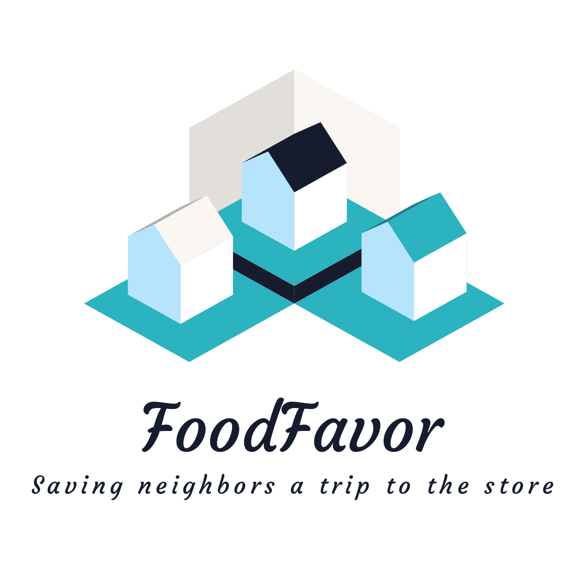

  <picture>
    
  </picture>

## Description

Neighbor to neighbor grocery shoppping and delivery app.

## Setup

1. `git clone git@github.com:foodfavor/food_favor_umbrella.git`
2. `asdf install` (Don't have asdf, install from [here](https://asdf-vm.com/guide/getting-started.html))
3. `mix setup` (from root directory) to install Elixir dependencies, build assets, and setup the database
4. `mix phx.server` to run the server (or `iex -S mix phx.server` to run in an IEx shell)
